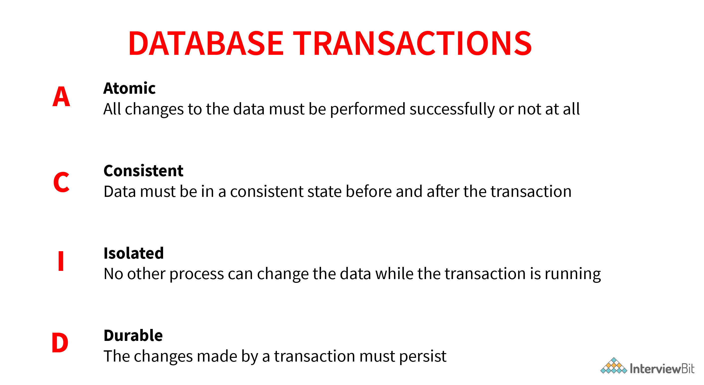

```
DDL(Data Definition Language):  It contains commands which are required to define the database.
E.g., CREATE, ALTER, DROP, TRUNCATE, RENAME, etc.
DML(Data Manipulation Language): It contains commands which are required to manipulate the data present in the database.
E.g., SELECT, UPDATE, INSERT, DELETE, etc.
DCL(Data Control Language):  It contains commands which are required to deal with the user permissions and controls of the database system.
E.g., GRANT and REVOKE.
TCL(Transaction Control Language):  It contains commands which are required to deal with the transaction of the database.
E.g., COMMIT, ROLLBACK, and SAVEPOINT.
```



- Normalization is a process of reducing redundancy by organizing the data into multiple tables. Normalization leads to better usage of disk spaces and makes it easier to maintain the integrity of the database.  

- Denormalization is the reverse process of normalization as it combines the tables which have been normalized into a single table so that data retrieval becomes faster. JOIN operation allows us to create a denormalized form of the data by reversing the normalization.

- DELETE deletes based on condition, can be rolled back, and maintains log => slow
- Truncate deletes all data, cannot be rolled back, and doesnt maintain log => fast

- Intension is database schema, defined during creation and remains unchanged, Extension is data, snapshot, keeps changing

# Keys in a Database

```
Candidate Key: A minimal set of attributes that uniquely identifies a tuple in a table.
Primary Key: A candidate key chosen to uniquely identify tuples and does not allow NULL values.
Super Key: A set of attributes that can uniquely identify a tuple, which is a superset of candidate keys.
Unique Key: Similar to a primary key but allows NULL values in the column.
Alternate Key: Candidate keys not chosen as the primary key.
Foreign Key: An attribute in one table that references the primary key of another table to establish a relationship.
Composite Key: A combination of two or more attributes that together uniquely identify a tuple in a table.
```

# Normalization forms

```
1NF :
Every column must have a single value and should be atomic.
Duplicate columns from the same table should be removed.
Separate tables should be created for each group of related data and each row should be identified with a unique column.
```

```
2NF :
The table should be in its 1NF i.e. satisfy all the conditions of 1NF.
Every non-prime attribute of the table should be fully functionally dependent on the primary key i.e. every non-key attribute should be dependent on the primary key in such a way that if any key element is deleted then even the non_key element will be saved in the database.
```

```
3NF :
The table should be in its 2NF i.e. satisfy all the conditions of 2NF.
There is no transitive functional dependency of one attribute on any attribute in the same table.
```

```
BCNF / 3.5NF:
The table should be in its 3NF i.e. satisfy all the conditions of 3NF.
For every functional dependency of any attribute A on B
(A->B), A should be the super key of the table. It simply implies that A can’t be a non-prime attribute if B is a prime attribute.
```

- A Trigger is a code associated with insert, update or delete operations , triggers — to maintain integrity, enforce rules, or log changes -> for DML operations


# Indexing
- Clustered indexes are the index according to which data is physically stored on a disk. Therefore, only one clustered index can be created on a given database table. 
- Non-clustered indexes don’t define the physical ordering of data, but logical ordering. Typically, a tree is created whose leaf point to disk records. B-Tree or B+ tree are used for this purpose.

# DROP vs TRUNCATE vs DELETE


# Functional Dependency
```
This is basically a constraint that is useful in describing the relationship among the different attributes in a relation.

Example: If there is some relation ‘R1’ which has 2 attributes as Y and Z then the functional dependency among these 2 attributes can be shown as Y->Z which states that Z is functionally dependent on Y.
```

# Joins
```
Inner Join: This type of join is used to fetch the data among the tables which are common in both tables.

Left Join: This returns all the rows from the table which is on the left side of the join but only the matching rows from the table which is on the right side of the join.

Right Join: This returns all the rows from the table which is on the right side of the join but only the matching rows from the table which is on the left side of the join.

Full Join: This returns the rows from all the tables on which the join condition has been put and the rows which do not match hold null values.
```

