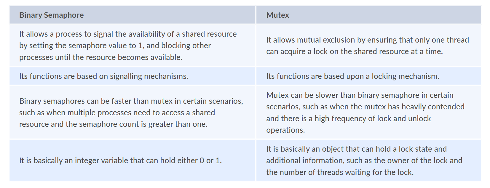

- RAID (Redundant Arrays of Independent Disks) is a method used to store data on Multiple hard disks therefore it is considered as data storage virtualization technology that combines multiple hard disks. ?

- Process synchronization is basically a way to coordinate processes that use shared resources or data. 

- Overlays is basically a programming method that divides processes into pieces so that instructions that are important and need can be saved in memory.  ?

- Thrashing : It is generally a situation where the CPU performs less productive work and more swapping or paging work. 

    - Processes generate a high number of page faults as their working set (the set of memory pages needed for current execution) cannot fit in the available memory.
    - The operating system tries to resolve the page faults by swapping pages in and out of memory.
    - If the memory pressure persists, this leads to a vicious cycle where swapping dominates over actual processing.

# Multiprogramming
- It refers to the ability to execute or perform more than one program on a single processor machine.
- Ready, Running, Blocked - 3 stages of a job in multiprogramming

# Time Sharing System
- allows different users from different locations to use a particular computer system at the same time

# Multitaking vs Multiprocessing
- Multitasking: It is a system that allows more efficient use of computer hardware. This system works on more than one task at one time by rapidly switching between various tasks. These systems are also known as time-sharing systems. 

- Multiprocessing: It is a system that allows multiple or various processors in a computer to process two or more different portions of the same program simultaneously. It is used to complete more work in a shorter period of time. 

- Time by Multitasking < Time by Multiprocessing

# Socket
- Sockets in an operating system are endpoints for sending and receiving data across a network / between processes / for IPC.
- Stream Sockets
- Datagram Sockets
- Sequenced Packet Sockets
- Raw Sockets

# Zombie Process
- Zombie process, referred to as a defunct process, is basically a process that is terminated or completed but the whole process control block is not cleaned up from the main memory because it still has an entry in the process table to report to its parent process. It does not consume any of the resources and is dead, but it still exists. It also shows that resources are held by process and are not free.

- To prevent zombies in real-world applications, ensure the parent always calls wait() or waitpid() for terminated child processes.

- fork a child process, let the child exit using _exit() or exit(), and have the parent process avoid calling wait() or waitpid() to reap the child's status.

- cascading termination : parent exit then child exit. Generally initiated by OS

# Scheduling
- Priority Scheduling or Shortest Job First Scheduling, Starvation can happen
- Starvation: process dont get resources for a long time, low prior get blocked and only high prior process are done => low prior suffer from starvation
- Aging: Technique used to overcome starvation, inc prior of process having long waiting time

- FCFS scheduling may cause the problem of starvation if the burst time of the first process is the longest among all the jobs.

- Scheduling algo's main aim is to reduce resource starvation and to ensure fairness amongst parties that are utilizing the resources.


# Paging and Segmentation ans Virtual Memory
- Paging: It is generally a memory management technique that allows OS to retrieve processes from secondary storage into main memory. It is a non-contiguous allocation technique that divides each process in the form of pages. 
- Segmentation: It is generally a memory management technique that divides processes into modules and parts of different sizes. These parts and modules are known as segments that can be allocated to process. 

- It is a memory management technique feature of OS that creates the illusion to users of a very large (main) memory. It is simply space where a greater number of programs can be stored by themselves in the form of pages. It enables us to increase the use of physical memory by using a disk and also allows us to have memory protection. It can be managed in two common ways by OS i.e., paging and segmentation. It acts as temporary storage that can be used along with RAM for computer processes. 

# Thread (part of a process ?)
- path of execution
- Has its own PC, Registers, Call Stack
- reduces the time required in context switching
- also called lightweight processes because they have their own stack and can access shared data
- Multiple threads running in a process share: Address space, Heap, Static data, Code segments, File descriptors, Global variables, Child processes, Pending alarms, Signals, and signal handlers. 
- Each thread has its own: Program counter, Registers, Stack, and State.

# Process
- New -> Ready -> Running -> Waiting (for IO)
             \____/  \____> Terminated

- Ready : Has all resources to run but has not been scheduled
```
Stack: It is used for local variables and returns addresses. 
Heap: It is used for dynamic memory allocation.
Data: It stores global and static variables.
Code or text: It comprises compiled program code.
```
```
Process: It is basically a program that is currently under execution by one or more threads. It is a very important part of the modern-day OS.

Thread: It is a path of execution that is composed of the program counter, thread id, stack, and set of registers within the process.
-> smallest unit of execution

```

# What is Reentrancy? ???

# Kernel 
```
central component or module of OS.

handling, managing, and controlling all operations of computer systems and hardware

acts as an interface between user applications and hardware.
```

```
What are different types of Kernel?
There are basically five types of Kernels as given below:

Monolithic Kernel
MicroKernel
Hybrid Kernel 
Nano Kernel
Exo Kernel
```

# Semaphores
- for synchronization in multi-thread / multi-process env
- a count of available resources and provides two atomic operations: wait() and signal()
- Binary Semaphore -> shared memory / a file
- Counting Semaphore -> finitre number of resources / pool of connections / number of threads

# Mutex


# Context Switching
- Context switching is basically a process of saving the context of one process and loading the context of another process.
- it allows multiple processes to share a single CPU
- This technique is used by OS to switch a process from one state to another i.e., from running state to ready state.
- It also allows a single CPU to handle and control various different processes or threads without even the need for additional resources

# Deadlock in OS
- two or more processes simply try to execute simultaneously and wait for each to finish their execution
- problems you can see in multiprocessing. 

```
There are basically 4 necessary conditions for deadlock as given below:

Mutual Exclusion
Hold and Wait
No Pre-emption
Circular Wait or Resource Wait
```

# Beladys Anomaly
- increase the number of frames in memory, then the number of page faults also increases.
- Frame : load page in fixed-size memory chunks called frames
- one chunk is called page

# Spooling
- Spooling simply stands for Simultaneous peripheral operations online.
- It is referred to as putting data of various I/O jobs in a buffer.
- Buffer -> special area of mem that can be accessed by I/O devices

# PCB -> process control block
```
PCB stands for process control block. It is like a table in which the attributes related to the individual process are stored.
 Attributes such as – 
Process Related – PID (Process Identification Number) 
CPU Related – Registers (Program Counter, General purpose registers, etc) priority states, etc.
Memory Related – Memory limits, Page Tables, etc.
Files related – Files required to access on disk.
I/O related – Keyboard, Monitors, Printers, etc
Protection Related – Permission, PSW(Process State Word), etc


the PCB of a process is stored in the main memory.


```